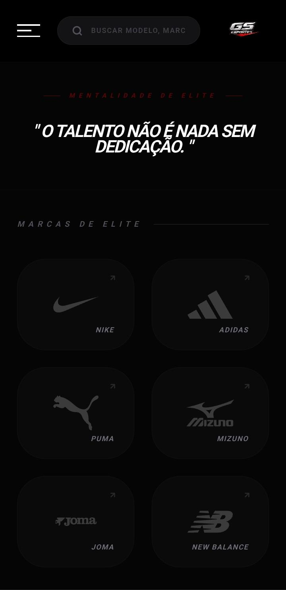
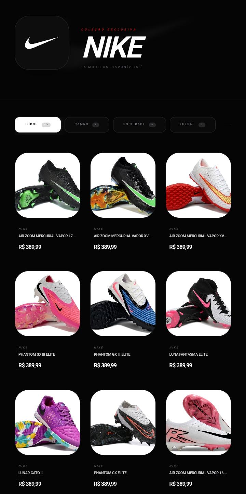
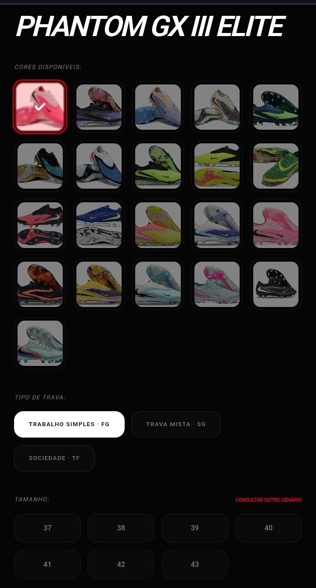

# GS Esportes — Catálogo de Chuteiras

Site de catálogo de chuteiras desenvolvido para a loja GS Esportes, com integração direta ao WhatsApp para finalização de pedidos.

🔗 **Site ao vivo:** [gs-esportes.vercel.app](https://gs-esportes.vercel.app)

---

## 📸 Screenshots

### Home


### Catálogo por Marca


### Página do Produto


### Finalizar Pedido


---

## 🚀 Funcionalidades

- Catálogo de chuteiras separado por marcas (Nike, Adidas, Puma, Mizuno, Joma, New Balance)
- Filtro por tipo: Campo (FG), Society (TF) e Futsal (IC)
- Seleção de cor e tamanho por produto
- Múltiplas fotos por produto com carrossel de imagens
- Integração com WhatsApp — mensagem automática com modelo, cor, tamanho e preço
- Preço no Pix e parcelamento no cartão
- Design responsivo para mobile

---

## 🛠️ Tecnologias utilizadas

**Backend**
- Python 3.14
- FastAPI
- SQLModel
- PostgreSQL
- Cloudinary (armazenamento de imagens)
- Railway (hospedagem)

**Frontend**
- React
- Vercel (hospedagem)

**Ferramentas**
- Git e GitHub
- Uvicorn

---

## 📁 Estrutura do projeto

app/
├── main.py        # Configuração principal da API
├── models.py      # Modelos do banco de dados
├── database.py    # Conexão com o banco
├── routes.py      # Rotas da API
└── fotos/         # Pasta de imagens locais

---

## ⚙️ Como rodar localmente

1. Clone o repositório
```bash
git clone https://github.com/ErickssDev/catalogo-chuteiras.git
cd catalogo-chuteiras
```

2. Instale as dependências
```bash
pip install -r requirements.txt
```

3. Crie o arquivo `.env` com as variáveis:
CLOUDINARY_CLOUD_NAME=seu_cloud_name
CLOUDINARY_API_KEY=sua_api_key
CLOUDINARY_API_SECRET=seu_api_secret
CORS_ORIGINS=http://localhost:5173

4. Rode o servidor
```bash
uvicorn app.main:app --reload
```

5. Acesse a documentação da API em `http://127.0.0.1:8000/docs`

---

## 📡 Endpoints principais da API

| Método | Rota | Descrição |
|--------|------|-----------|
| GET | `/marcas` | Lista todas as marcas |
| GET | `/modelos` | Lista todos os modelos |
| GET | `/modelos/tipo/{tipo}` | Filtra modelos por tipo |
| GET | `/marcas/{id}/modelos` | Modelos de uma marca |
| GET | `/chuteiras` | Lista todas as chuteiras |
| GET | `/chuteiras/{id}` | Busca uma chuteira |
| GET | `/modelos/{id}/chuteiras` | Chuteiras de um modelo |
| POST | `/chuteiras/{id}/fotos` | Upload de foto |

---

## 👨‍💻 Desenvolvido por

- **Backend:** Feito por [ErickssDev](https://github.com/ErickssDev)
- **Frontend:** Feito por [DigueraDev](https://github.com/digueraDEV)